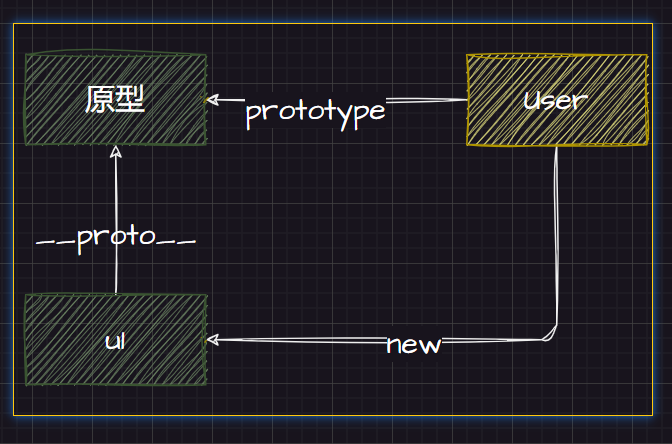
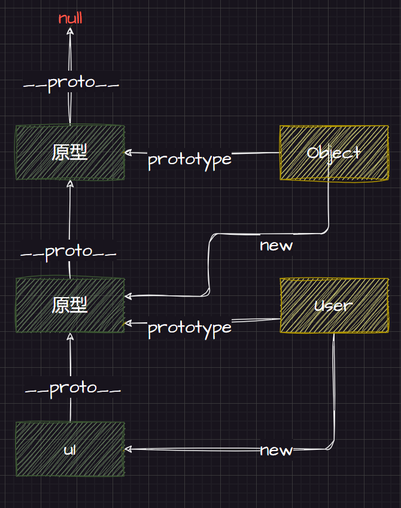
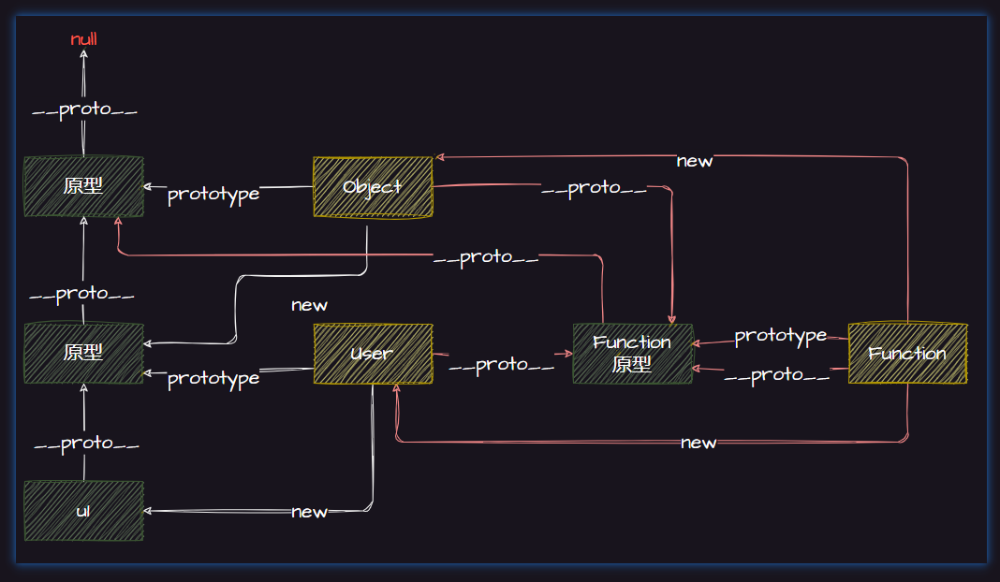

- [原型链](#原型链)
  - [什么是原型链](#什么是原型链)
  - [完整的链条](#完整的链条)
  - [拼接上 Function 的完整链条](#拼接上-function-的完整链条)
  - [对开发的影响](#对开发的影响)

# 原型链

## 什么是原型链

> 所有的对象都是通过 **new 函数** 的方式创建的
> 

```js
function User() {}
var u1 = new User();
// 等效于
var u2 = {};
```

原型对象本身也是一个对象,默认情况下是通过 **new Object** 创建的

## 完整的链条



> Object.prototype.**\_\_proto\_\_**比较特殊,是固定指向 null

> 当读取对象成员时,会先查看自身有没有该成员,如果没有,就依次在其原型链上查找

链条解读:

1. 自定义构造函数,这个函数定义出来后就会有一个原型对象 通过 prototype 获取到
2. 通过 new 自定义构造函数() 得到一个实例,这个实例有一个隐式原型就是自定义构造函数的原型 通过\_\_proto\_\_ 获取到
3. 自定义构造函数的原型对象 是一个普通对象{},是对象就等同于是通过 new Object() 创建来的,所以这个原型对象是一个实例,是实例就有一个\_\_proto\_\_ 属性指向 Object 的原型
4. Object 的原型对象比较特殊 因为上面自定义构造函数的原型对象指向 Object 的原型对象,但是 Object 已经属于原型链中最顶层了,所以 **Object 的原型对象 它的\_\_proto\_\_ 指向 null**

## 拼接上 Function 的完整链条



链条解读:

1. Function,它是浏览器运行起就有这样一个构造函数,所有的构造函数都是通过 **new Function()** 创建的
2. Object() 构造函数 是通过 new Function() 产生的,所以对于 Object 来说也是一个实例,是实例就有一个隐式原型\_\_proto\_\_,因为 **\_\_proto\_\_** 是用来指向原型的,所以它的 **\_\_proto\_\_** 指向 Function()这个构造函数的原型,包括所有的自定义构造函数(它的隐式原型都指向 Function()构造函数的原型)
3. 但是总而言之 Function 原型也是一个普通对象,所以它这个对象实例的隐式原型指向 Object 的原型
4. 这里有个特殊的点类似于 Object 的原型指向 null 一样,**Function()构造函数的 prototype 与\_\_proto\_\_都指向它的原型对象 (Function 原型对象)**

```js
// 示例 函数上为什么会有 call & apply
function method() {}
// 因为 函数的隐式原型指向的Function的原型 Function的原型上有call&apply
console.log(method.call === Function.prototype.call); // true
```

> 需要在所有对象上增加属性,就加在 Object 的原型上
> 需要在所有函数上增加属性,就加在 Function 的原型上

## 对开发的影响

1. 在原型上更改会产生多大影响

正常开发中 我们一般更改自定义构造函数的原型,例如 toString()函数

```js
function User() {}
User.prototype.toString = function () {
  return "xxx";
};
// 这样使用User构造函数产生的实例使用的toString()函数就是重写过的,但是如果更改Object原型上的toString()函数,会影响到所有得到对象,一般不会这样去更改
```

2. 学会利用原型链来判断类型
   > instanceof

```js
// 示例1
var arr1 = [1, 2, 3, 4];
console.log(arr1 instanceof Array); // true   ---  arr1 是真数组

// 示例2
var arr2 = {
  0: 1,
  1: 2,
  2: 3,
  3: 4,
  length: 4,
};

console.log(arr1 instanceof Array); // false   ---  arr2 不是真数组
```

3. 创建干净的对象

```js
// 示例1
var obj = {};
obj.__proto__ = null; // __proto__ 赋空值 这种方式 官方不推荐使用了
console.log(obj); // 断开了指向Object的原型,所以没有了任何它的属性

// 虽然不建议直接使用对象的__proto__但是官方提供了 Object.getPrototypeOf(obj); 来让我们获取隐式原型
// 跟上面的做法一样 但是会限制只能传入对象或null 第二个参数是设置对象的隐式原型  这里设为空对象
Object.setPrototypeOf(obj, {});

// 示例2
var obj2 = Object.create(null);
console.log(obj2); // 可以创建一个非常干净的对象 跟示例1一样 但是推荐这种做法
```
