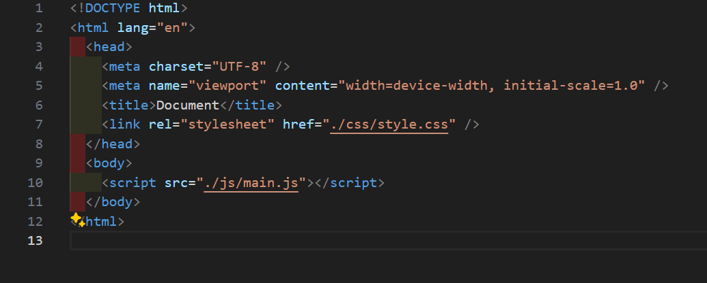

- [浏览器渲染原理](#浏览器渲染原理)
  - [解析 HTML](#解析-html)
  - [生成 DOM 树](#生成-dom-树)
  - [生成渲染树](#生成渲染树)
  - [重排](#重排)
  - [重绘（repaint）](#重绘repaint)

# 浏览器渲染原理

## 解析 HTML

浏览器从网络或本地文件中获取 HTML 源代码，然后从上到下的**解析源代码**

若解析过程中，读到 CSS 或 JS,停止解析（阻塞），从而解析 CSS 或 JS



## 生成 DOM 树

**浏览器会一边解析 HTML，一边生成 DOM 树**，我们在 JS 中获取的 DOM 就时 DOM 树中的 DOM

```js
<!DOCTYPE html>
<html lang="en">
  <head>
    <meta charset="UTF-8" />
    <meta name="viewport" content="width=device-width, initial-scale=1.0" />
    <title>Document</title>
    <link rel="stylesheet" href="./css/style.css" />
    <script>
      document.addEventListener("DOMContentLoaded", () => {
        console.log("HTMLDOM树加载完成 DOMContentLoaded");
        var h1 = document.querySelector("h1");
        console.log(h1);
      });

      window.onload = () => {
        console.log("所有资源加载完成（HTML,CSS,JS） onload");
        var h1 = document.querySelector("h1");
        console.log(h1);
      };
    </script>
  </head>
  <body>
    <h1>hello world</h1>
    
    
    <script src="./js/main.js"></script>
  </body>
</html>

// js
var img1 = document.getElementById("img1");
var img2 = document.getElementById("img2");
img1.onload = () => {
  console.log("图片加载完成 onload");
  img1.style.display = "block";
  setTimeout(() => {
    img2.style.display = "block";
  }, 3000);
};

```

## 生成渲染树

浏览器一边生成 DOM 树，一边计算 DOM 树中每个节点的样式规则，最终形成渲染树。

CSS 属性的计算过程，发生在这一步

## 重排

但凡是修改了元素的位置信息的样式 就会导致重排

## 重绘（repaint）

浏览器一边 reflow,一边进行生成对应的图形绘制到页面，绘制的过程称为重绘。

只要能导致重排的代码 就会导致重绘
以下一些修改样式的代码仅仅会导致重绘：

```css
color: red;
border-radius: 5px;
background: white;
/** 改变背景图等 没有改变元素位置的样式仅导致重绘 */
```
