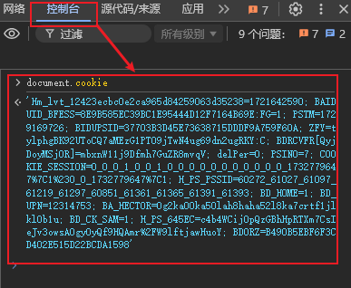
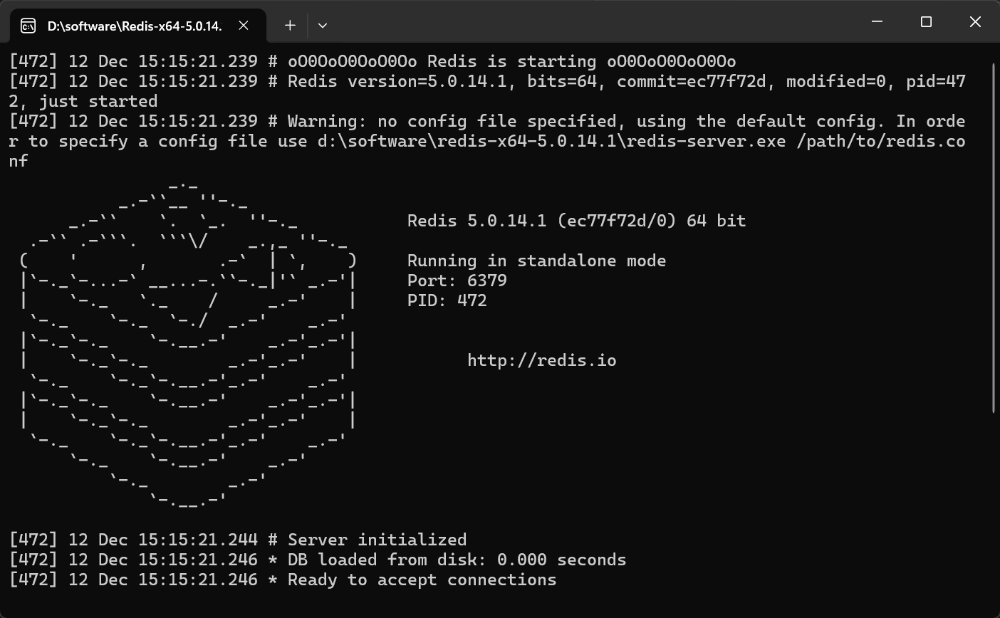
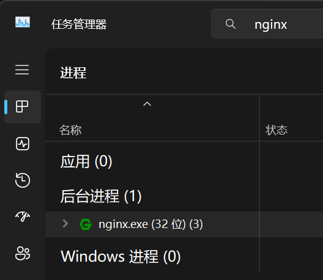

- [nodejs](#nodejs)
  - [nodejs 与 JavaScript 的区别](#nodejs-与-javascript-的区别)
  - [项目结构](#项目结构)
  - [mysql](#mysql)
  - [cookie](#cookie)
  - [session](#session)
  - [redis](#redis)
  - [nginx](#nginx)
  - [日志](#日志)
    - [目录](#目录)
    - [nodejs 文件操作](#nodejs-文件操作)
    - [IO 操作的性能瓶颈](#io-操作的性能瓶颈)
      - [Stream](#stream)

# nodejs

## nodejs 与 JavaScript 的区别

- ECMAScript
  是语法规范
- nodejs
  ECMAScript+nodejs api
- commonjs
- nodejs debugger

## 项目结构

```bash
.
├── app.js                                                      # 基础设置相关逻辑
├── package.json                                                # 依赖包
└── bin
    ├── www.js                                                  # 创建Server相关逻辑
└── src
    ├── controller                                                # controller
    │   ├── blog.js                                                   # 博客
    │   └── user.js                                                   # 用户
    ├── model                                                   # 数据库model目录
    │       ├── resModel.js                                           # 定义返回数据的模型
    ├── router                                                    # 路由
    │    ├── index.js                                                 # 路由模块集合
    │    └── modules                                                  # 路由模块
    │       ├── blog.js                                                  # blog 的路由
    │       └── user.js                                                  # user 的路由

```

## mysql

> 可视化工具[https://dev.mysql.com/downloads/workbench/]

查询所有数据库
`show databases`

创建 blog 数据库

```sql
CREATE SCHEMA `myblog` ;
```

创建用户表

```sql
CREATE TABLE `myblog`.`users` (
  `id` INT NOT NULL AUTO_INCREMENT,
  `username` VARCHAR(20) NOT NULL,
  `password` VARCHAR(20) NOT NULL,
  `realname` VARCHAR(10) NOT NULL,
  PRIMARY KEY (`id`));

```

创建 blog 表

```sql
CREATE TABLE `myblog`.`blogs` (
  `id` INT NOT NULL AUTO_INCREMENT,
  `title` VARCHAR(50) NOT NULL,
  `content` LONGTEXT NOT NULL,
  `createtime` BIGINT(20) NOT NULL,
  `author` VARCHAR(20) NOT NULL,
  PRIMARY KEY (`id`));

```

增加一个字段

```sql
ALTER TABLE `myblog`.`users`
ADD COLUMN `state` INT NOT NULL DEFAULT 1 AFTER `realname`;
```

删除一个字段

```sql
ALTER TABLE `myblog`.`users`
DROP COLUMN `state`;

```

```sql
-- 插入user数据
insert into users(username,`password`,realname) values('zhangsan','123','张三');
insert into users(username,`password`,realname) values('lisi','123','李四');
-- 查询user表数据
select * from users;
select id,username from users;
select * from users where username = 'zhangsan' and `password` = '123';
select * from users where username like '%zhang%';
select * from users where password like '%1%' order by id desc;

-- 更新user
-- update users set realname = '李四2' where username='lisi';
-- Error Code: 1175.  You are using safe update mode and you tried to update a table without a WHERE that uses a KEY column.   To disable safe mode, toggle the option in Preferences -> SQL Editor and reconnect.
-- 禁用安全模式
SET SQL_SAFE_UPDATES = 0;
update users set realname = '李四2' where username='lisi';

-- 删除
delete from users where username='lisi';
-- 开发中删除 示例：软删除
update users set state = 1 where username='lisi';
select * from users where state <> 0;
```

添加 blogs 测试数据

```sql
select * from blogs order by createtime desc;
insert into blogs(title,content,createtime,author) values('标题A','内容A',1733909793093,'zhangsan');
insert into blogs(title,content,createtime,author) values('标题B','内容B',1733909871598,'lisi');
```

mqsql 新特性 varchar(10) 数据类型

> 以前中文字符占两个长度 英文字符占一个长度 ,在 >=5 以上的版本都统一化了 中文字符也占一个长度

```sql
select version();
-- 8.4.0
```

- 根据 NODE_ENV 区分配置

```json
// package.json
"dev": "cross-env NODE_ENV=dev nodemon bin/www.js",
"prod": "cross-env NODE_ENV=prod nodemon bin/www.js"
```

```js
// src/config/db.js
// 配置
let MYSQL_CONF;

if (env === "dev") {
  MYSQL_CONF = {
    host: "localhost",
    user: "root",
    password: "000000",
    port: "3306",
    database: "myblog",
  };
}

if (env === "prod") {
  MYSQL_CONF = {
    host: "localhost",
    user: "root",
    password: "000000",
    port: "3306",
    database: "myblog",
  };
}
```

> pnpm dev -- 运行后处于开发模式

- 封装 exec 函数，API 使用操作数据库

```js
const mysql = require("mysql2");
const { MYSQL_CONF } = require("../config/db");

// 创建连接对象
const con = mysql.createConnection(MYSQL_CONF);

// 开始连接
con.connect();

// 统一执行 sql 的函数
function exec(sql) {
  return new Promise((resolve, reject) => {
    con.query(sql, (err, result) => {
      if (err) {
        reject(err);
        return;
      }
      resolve(result);
    });
  });
}

module.exports = { exec };
```

## cookie

- 什么时 cookie
  1. 存储在浏览器中的一段字符串（最大 5kb）
  2. 跨域不共享
  3. 格式如 k1=v1;k2=v2;k3=v3; 因此可以存储结构化数据
  4. 每次发送 http 请求，会将请求域的 cookie 一起发送给 server
  5. server 端可以修改 cookie 并返回给浏览器
  6. 浏览器中也可以通过 javascript 修改 cookie（有限制）
- javascript 操作 cookie,浏览器中查看 cookie
  - 客户端查看 cookie 三种方式
    1. 
    2. 
    3. 
  - javascript 查看、修改 cookie（有限制）
    1. 做累加(会追加到 cookie 值的后边)
       document.cookie = 'k1=100;'
- server 端操作 cookie,实现登录验证

  - 查看 cookie

    ```js
    // 解析 cookie
    const cookieStr = req.headers.cookie || ""; // k1=v1;k2=v2;k3=v3
    req.cookie = {}; // 用来存储cookie
    cookieStr.split(";").forEach((item) => {
      if (!item) {
        return;
      }

      const arr = item.split("=");
      const key = arr[0];
      const val = arr[1];
      req.cookie[key] = val;
    });
    console.log("req.cookie--", req.cookie);
    ```

  - 修改 cookie

    ```js
    // 操作 cookie  before
    res.setHeader("Set-Cookie", `username=${data.username}; path=/;`);

    // 限制前端修改cookie after
    // 操作 cookie  path=/ 表示根目录下都可以访问  httpOnly 表示只能通过后端修改
    // 操作 cookie  path=/ 表示根目录下都可以访问  httpOnly 表示只能通过后端修改 expires 表示过期时间
    res.setHeader(
      "Set-Cookie",
      `username=${
        data.username
      }; path=/; httpOnly; expires=${getCookieExpires()}`
    );
    ```

  - 实现登录验证

    ```js
    // 登录验证的测试   -- http://localhost:8000/api/user/login-test
    if (method === "GET" && req.path === "/api/user/login-test") {
      if (req.cookie.username) {
        return Promise.resolve(
          new SuccessModel({ username: req.cookie.username })
        );
      }
      return Promise.resolve(new ErrorModel("尚未登录"));
    }
    ```

- 全选单个函数名称 ctrl + D

## session

cookie 中一般不存储明文相关信息，并且 cookie 只能存储 5kb 数据

解决：
cookie 中存储 userid,server 端对应 username,因为 server 端没有数据大小限制

- 使用 session 存在的问题

目前 session 直接是 js 变量,放在 nodejs 进程内存中

```js
// session 数据
const SESSION_DATA = {};

// 解析 session
let needSetCookie = false;
let userId = req.cookie.userid;

// 已登录
if (userId) {
  if (!SESSION_DATA[userId]) {
    SESSION_DATA[userId] = {};
  }

  console.log("SESSION_DATA--", SESSION_DATA);
} else {
  // 未登录
  needSetCookie = true;
  userId = `${Date.now()}_${Math.random()}`;
  SESSION_DATA[userId] = {};
}
req.session = SESSION_DATA[userId];
```

1. 进程内存有限，访问量过大，内存暴增怎么办？
2. 正式线上环境是多进程，进程直接内存无法共享

问题的根源来自于 session 数据目前储存在进程的内存中 如果数据过大 内存会被挤爆

解决方案 redis（及 redis 使用场景）

- 为什么 session 适合用 redis?
  1. session 访问频率高，对性能要求高
  2. session 可不考虑断电丢失数据问题（内存的硬伤）
  3. session 数据量不会很大（相比于 mysql 中存储的数据）
- 为什么网站数据不适合用 redis?
  1. 操作频率不是太高（相比于 session 操作）
  2. 断电不能丢失，必须保留(只适合保存到硬盘数据库中)
  3. 数据量太大，内存成本过高

## redis

- web server 最常用的缓存数据库，数据放在内存中
- 相比 MySQL，访问速度快（内存和硬盘不是一个数量级的）
- 但是成本更高，可存储的数据量更小（内存的硬伤 ）
  

- Windows [http://www.runoob.com/redis/redis-install.html]
- Mac 使用 `brew install redis`

- 启动 redis-server.exe
  
- 运行 redis-cli

```shell
D:\software\Redis-x64-5.0.14.1>redis-cli.exe
127.0.0.1:6379> set mykey abc
OK
127.0.0.1:6379> get mykey
"abc"
127.0.0.1:6379>
```

- 操作 redis
  `set [key] [value]`
  `get [key]`
  `keys *`
  `del [key]`

## nginx

场景：

- 登录功能依赖 cookie,必须使用浏览器联调
- cookie 跨域不共享，前端和 server 端必须同域(都在本地用一个端口会导致一方不能运行)
- 需要用到 nginx 做代理，让前后端同域

介绍：

- 高性能的 web 服务器，开源免费
- 一般用于做静态服务器、负载均衡
- 反向代理（该 demo 使用到）

下载安装：

- windows [http://nginx.org/en/download.html]
- mac `brew install nginx`

> 配置文件
> windows: C:\nginx\conf\nginx.conf
> mac: /usr/local/etc/nginx/nginx.conf

测试配置文件格式是否正确

> `nginx -t`

启动

> `nginx.exe` or `start nginx` > 

重启

> `nginx.exe -s reload`

停止

> `nginx.exe -s stop`

- nginx 文件配置

```conf
server {
  listen       8888;
  server_name  localhost;

  # ...
  location / {
      proxy_pass http://localhost:8001;
  }

  location /api/ {
      proxy_pass http://localhost:8000;
      proxy_set_header Host $host;

      # 添加跨域支持
      add_header Access-Control-Allow-Origin *;
      add_header Access-Control-Allow-Methods GET,POST,PUT,DELETE,OPTIONS;
      add_header Access-Control-Allow-Headers Content-Type,Authorization;

      # 处理 OPTIONS 请求
      if ($request_method = 'OPTIONS') {
          add_header Access-Control-Allow-Origin *;
          add_header Access-Control-Allow-Methods GET,POST,PUT,DELETE,OPTIONS;
          add_header Access-Control-Allow-Headers Content-Type,Authorization;
          return 204;
      }
  }
}
```

> `listen 8888;` 监听一个代理的端口
> `server_name  localhost;` 服务器 ip 或者域名

```conf
location / {
  proxy_pass http://localhost:8001;
}
```

> 配置 `/` 需要代理到的地址 "这里指前端地址"

```conf
location /api/ {
      proxy_pass http://localhost:8000;
      proxy_set_header Host $host;
  }
```

> 配置 `/api/` 需要代理到的地址 "这里值 server"

- 测试请求
  > 前端从 8000 请求 `listen 8888;` 配置的这个端口 看是否能请求到服务端的数据 代理到 8001

## 日志

- 系统没有日志，等于人没有眼睛---抓瞎
- 第一，访问日志 access log(server 端最重要的日志)
- 第二，自定义日志(包括自定义事件，错误记录等)

### 目录

1. nodejs 文件操作，nodejs stream
2. 日志功能开发和使用
3. 日志文件拆分，日志内容分析

### nodejs 文件操作

- 日志要存储到文件中
  适合进行文件读入、写入
- 为何不存储在 mysql 中？
  硬盘数据库，不适合存储文件
- 为何不存储在 redis 中？
  内存数据库，不适合存储文件

### IO 操作的性能瓶颈

- IO 包括 “网络 IO” 和 “文件 IO”
- 相比于 CPU 计算和内存读写，IO 的突出特点就是：慢！
- 如何实现在有限的硬件资源下提高 IO 的操作效率？

#### Stream

- source
- dest
