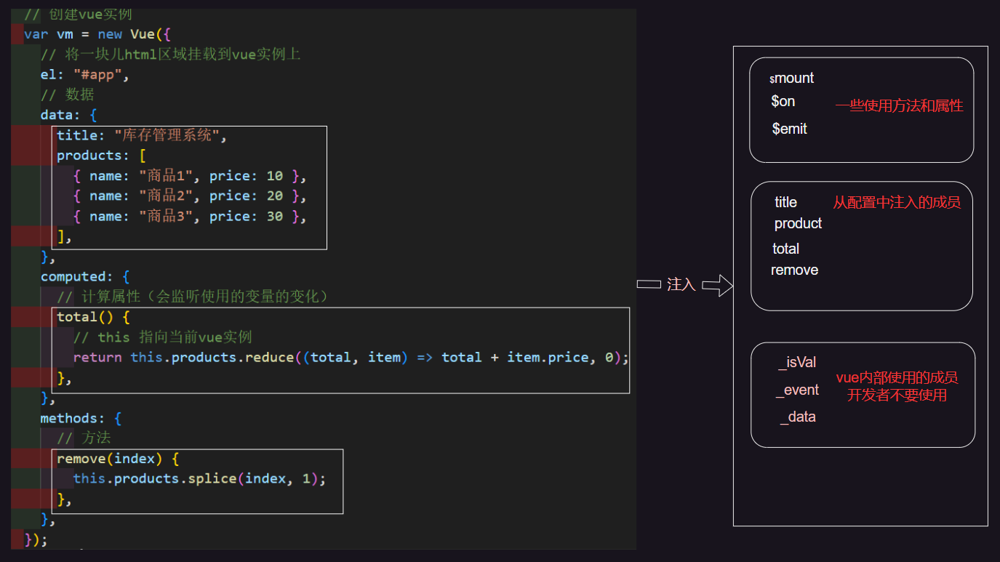
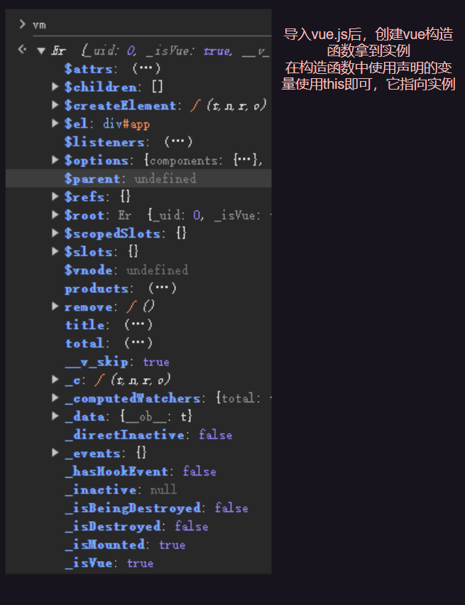
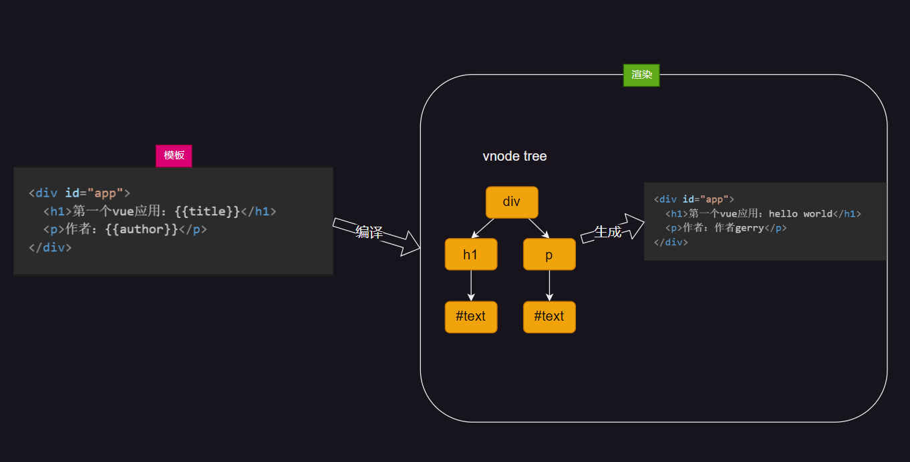
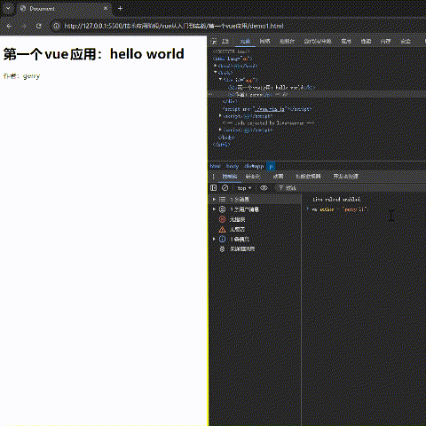
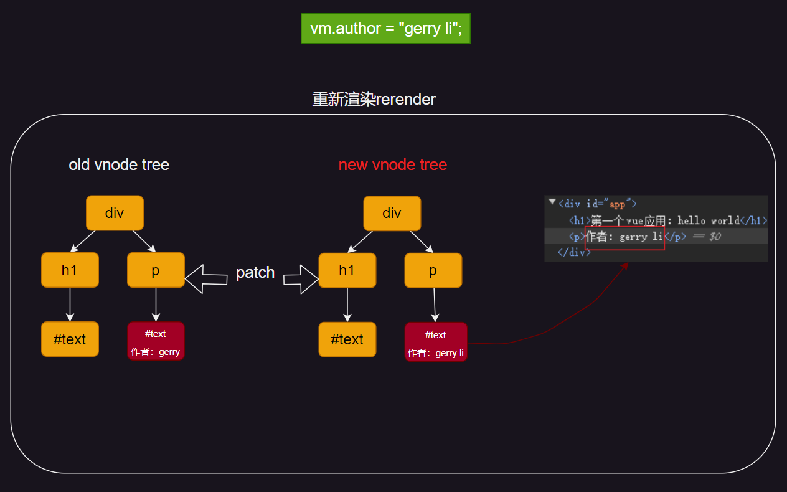
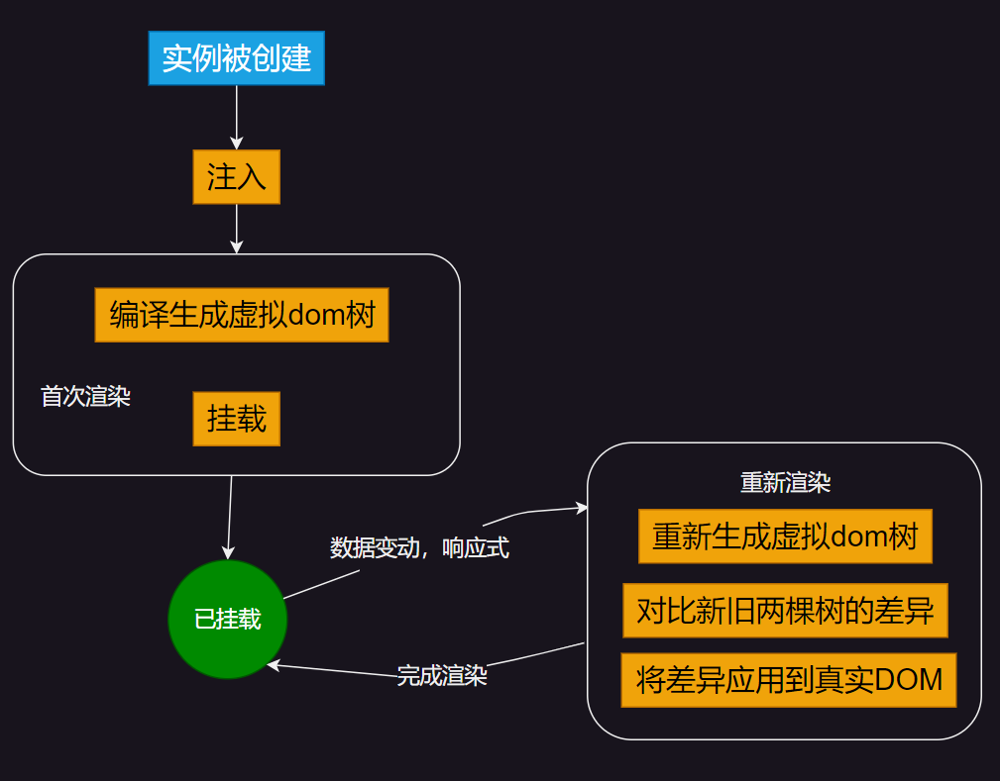
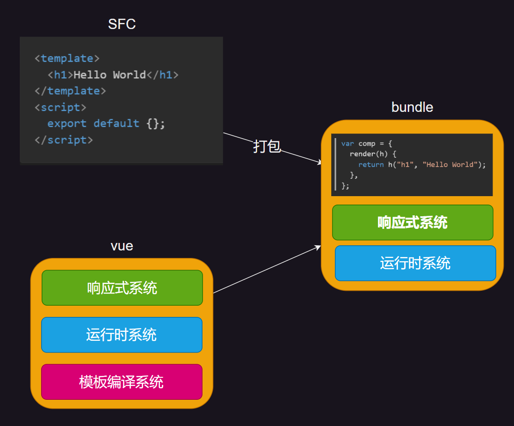
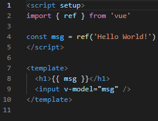
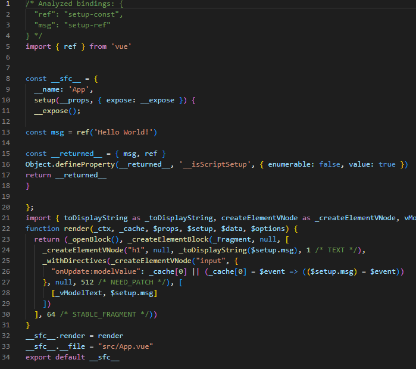

- [vue 入门概念](#vue-入门概念)
  - [注入](#注入)
  - [虚拟 dom 树](#虚拟-dom-树)
  - [挂载](#挂载)
  - [完整流程](#完整流程)
  - [vue 知识体系](#vue-知识体系)
    - [模板](#模板)
      - [内容](#内容)
      - [指令](#指令)
    - [配置](#配置)
  - [组件](#组件)
    - [组件注册](#组件注册)
      - [全局注册](#全局注册)
      - [局部注册](#局部注册)
      - [应用组件](#应用组件)
      - [向组件传递数据](#向组件传递数据)
- [vue-cli](#vue-cli)
  - [SFC](#sfc)
  - [预编译](#预编译)

## vue 入门概念

### 注入





### 虚拟 dom 树

直接操作真实的 DOM 会引发严重的效率问题，vue 使用虚拟（VNode）的方式来描述要渲染的内容
VNode 是一个普通的 js 对象，用于描述界面上有什么，比如：

```js
var vnode = {
  tag: "h1",
  children: [{ tag: undefined, text: "第一个vue应用：hello world" }],
};
```

上面的对象描述了：

> 有一个标签名为 h1 的节点，他有一个子节点，该子节点是一个文本，内容为【第一个 vue 应用：hello world】

vue 模板并不是真实的 DOM，它会被编译为虚拟 DOM

```html
<div id="app">
  <h1>第一个vue应用：{{title}}</h1>
  <p>作者：{{author}}</p>
</div>
```

上面的模板会被编译为类似下面结构的虚拟 DOM 树：

```js
{
    tag: "div",
    children: [
        {tag: "h1",children:[{text: "第一个vue应用：hello world"}]},
        {tag: "p",children:[{text: "作者gerry"}]},
    ]
}
```

再通过 vue 的虚拟 dom 树最终生成真实的 dom：

```html
<div id="app">
  <h1>第一个vue应用：hello world</h1>
  <p>作者：作者gerry</p>
</div>
```



当数据发生变化后，将引发重新渲染，vue 会比较新旧两棵 vnode tree,找出差异，然后仅仅把差异部分应用到真实 dom tree 中






Vue 构造函数中会：

1. 判断有没有 render 函数，有则直接返回
2. 没有则检测有没有配置 tempalte，有则编译为 render 函数
3. 没有配置 template 则检测 el 属性有没有配置根节点，没有则报错

> 虚拟 dom 是具有单根性的。

### 挂载

vue 框架是渐进式的 可以只控制一个项目中的某一块儿 dom
挂载的方式：

1. 通过 el: "css 选择器" 进行配置
2. 通过 vue 实例.$mount("css 选择器")进行配置(比如异步读取一些项目配置文件，读取成功后才挂载 dom)

### 完整流程



### vue 知识体系

#### 模板

##### 内容

mustache 语法

##### 指令

1. v-bind
2. v-for
   > 循环加入 key 属性 提高渲染效率(新旧虚拟 dom 树对比效率)
3. v-on

#### 配置

1. data
2. computed
3. methods
4. template
5. render
6. el
7. components
8. props

### 组件

```js
var myButton = {
  data() {
    return {
      // ...
    };
  },
};
```

组件配置对象与 vue 实例有以下几点区别：

1. 无 **el**
2. data 必须是一个函数，该函数返回的对象作为数据
3. 由于没有**el**配置，组件的虚拟 DOM 树必须定义在 template 或 render 中

#### 组件注册

组件分为全局注册跟局部注册

##### 全局注册

一旦全局注册后在整个应用的任何地方都可以使用该组件

```js
Vue.component("my-button", myButton);
```

在模板中就可以直接使用了

```html
<my-button />
```

##### 局部注册

```js
var vm = new Vue({
  el: "#app",
  components: {
    // 局部注册组件(只能在当前实例中使用)
    "my-button": myButton,
  },
  data: {
    message: "Hello Vue!",
  },
});
```

##### 应用组件

在模板中直接给组件当 HTML 元素使用即可
注意以下几点：

1. 组件必须要有结束

组件可以自结束，也可以用结束标记，但是必须要有结束

2. 组件的命名

- PascalCase 大驼峰命名
- kebab-case 短横线命名

##### 向组件传递数据

大部分组件要完成自身的功能，都需要一些额外的信息

比如一个头像组件，需要告诉它头像的地址，这就需要向组件传递数据

最常见的一种传递方式就是 **compoennt props**

- 数组形式接受数据：

```js
var myComp = {
  props:['p1','p2','p3'];
  template:`
    <div>
      {{p1}},{{p2}},{{p3}}
    </div>
  `
}
```

在使用组件时，向其传递数据：

```js
var otherComp = {
  components: {
    "my-comp": myComp,
  },
  data() {
    return {
      a: 1,
    };
  },
  template: `
    <my-comp :p1='a' :p2='b' :p3='c' />
  `,
};
```

> 注意 在组件内部不能更改传递过来的属性，这叫做单向数据流，只能改自己内部 的 data 数据

- 对象形式接受数据:

```js
var myComp = {
  props:{
    url:String
  };
  template:`
    <div>
      {{p1}},{{p2}},{{p3}}
    </div>
  `
}
```

## vue-cli

https://cli.vuejs.org/zh/guide/installation.html

vue-cli 是一个脚手架工具，用于搭建 vue 工程

它内部使用了 webpack，并预置了许多插件(plugin)和加载器(loader),以达到开箱即用的效果

除了基本的插件和加载器外，vue-cli 还预置了：

- babel
- webpack-dev-server
- eslint
- postcss
- less-loader

### SFC

单文件组件，Single File Component,即一个文件就包含了一个组件所需要的全部代码

### 预编译

当 vue-cli 进行**打包**时，会直接把组件中的模板转换为 **render** 函数，这叫做模板预编译

这样做的好处在于：

1. 运行时不需要在编译模板了，提高运行效率
2. 打包结果中不再需要 vue 的编译代码，减少了打包体积

- SFC

```html
<template>
  <h1>Hello World</h1>
</template>
<script>
  export default {};
</script>
```

- vue

1. 响应式系统
2. 运行时系统
3. 模板编译系统

- bundle

1. 模板编译系统将 SFC 中的**template**中的内容编译为 render 函数
2. 响应式系统
3. 运行时系统

---

```js
var comp = {
  render(h) {
    return h("h1", "Hello World");
  },
};
```



> render 函数是最终编译结果，无论是组件中的 template 还是 SFC 中的 template 最终都是会经过 vue 的模板编译系统 将其编译为 render 函数

https://play.vuejs.org/#eNp9kUFLwzAUx7/KM5cqzBXR0+gGKgP1oKKCl1xG99ZlpklIXuag9Lv7krK5w9it7//7v/SXthP3zo23EcVEVKH2yhEEpOhm0qjWWU/QgccV9LDytoWCq4U00tTWBII2NDBN/LJ4Qq0tfFuvlxfFlTRVORzHB/FA2Dq9IOQJoFrfzLouL/d9VfKUU2VcJNhet3aJeioFcymgZFiVR/tiJCjw61eqGW+CNWzepX0pats6pdG/OVKsJ8UEMklswXa/LzkjH3G0z+s11j8n8k3YpUyKd48B/RalODBa+AZpwPPPV9zx8wGyfdTcPgM/MFgdk+NQe4hmydpHvWz7nL+/Ms1XmO8ITdhfKommZp/7UvA/eTxz9X/d2/Fd3pOmF/0fEx+nNQ==




